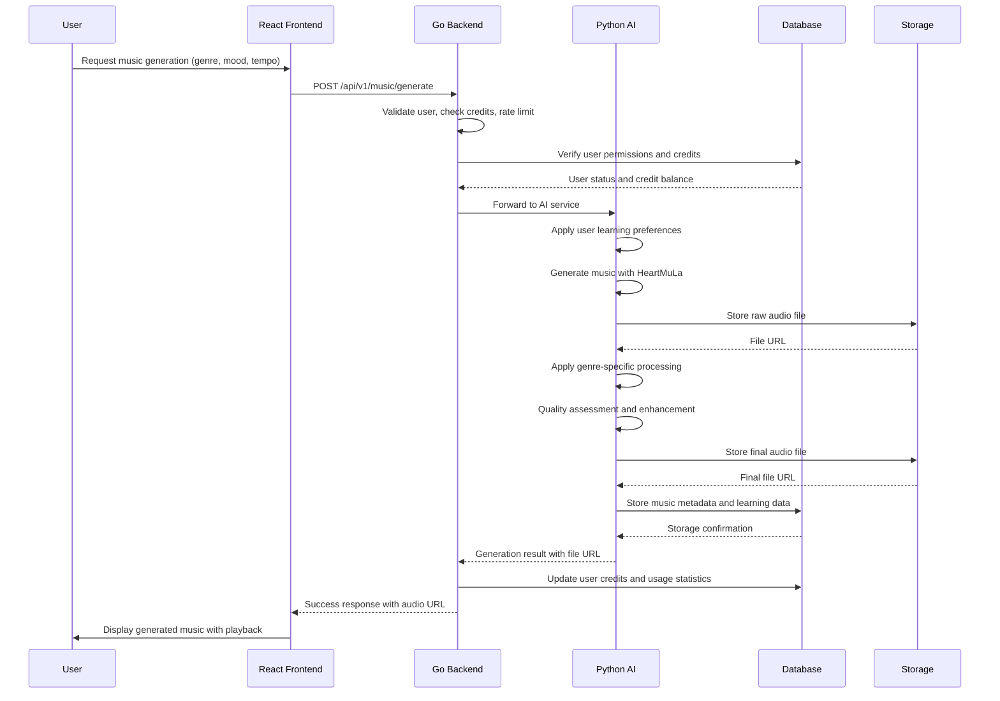
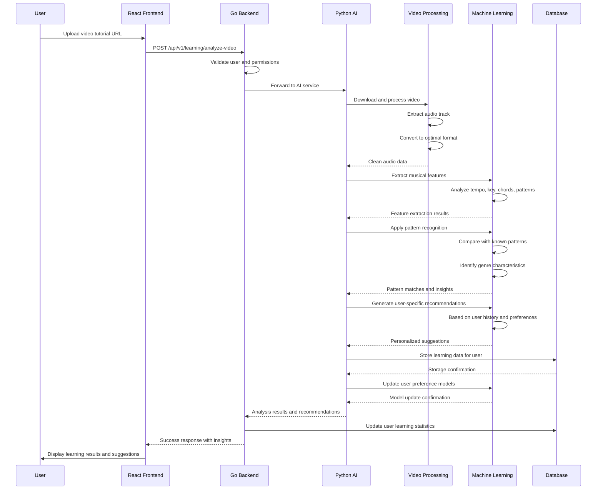
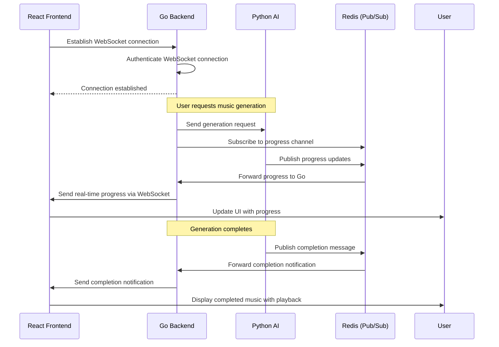

# System Architecture Documentation

**Project:** Auto LoFi & Hyper Pop Music Producer  
**Task Code:** RSCH023  
**Version:** 1.0  
**Last Updated:** May 22, 2026

## Table of Contents
1. [Overview](#overview)
2. [Architecture Principles](#architecture-principles)
3. [System Components](#system-components)
4. [Data Flow](#data-flow)
5. [Technology Stack](#technology-stack)
6. [Communication Patterns](#communication-patterns)
7. [Scalability Strategy](#scalability-strategy)
8. [Security Considerations](#security-considerations)
9. [Deployment Architecture](#deployment-architecture)

---

## Overview

The Auto LoFi & Hyper Pop Music Producer is a hybrid web application that combines React frontend, Go backend, and Python AI services to create an AI-powered music generation platform. The system is designed to be scalable, maintainable, and commercially viable.

### Key Design Goals
- **Scalability:** Handle thousands of concurrent users and music generation requests
- **Performance:** Sub-second response times for API calls, efficient AI model processing
- **Maintainability:** Clear separation of concerns, standardized development practices
- **Commercial Viability:** Multiple revenue streams with cost-effective infrastructure
- **Extensibility:** Easy to add new AI models, genres, and features

---

## Architecture Principles

### 1. **Microservices Architecture**
The system is built using a microservices approach with clear separation between frontend, backend API, and AI services.

**Why?**
- Independent scaling of different components
- Easier team development and deployment
- Better fault isolation
- Technology flexibility (use best language for each task)

### 2. **Domain-Driven Design**
Each service is organized around business domains: User Management, Music Generation, Learning System, Billing, etc.

**Why?**
- Better alignment with business requirements
- Easier to understand and maintain
- Clear ownership and responsibility

### 3. **API-First Design**
All services communicate through well-defined APIs with clear contracts.

**Why?**
- Technology independence between services
- Easy testing and mocking
- Clear service boundaries
- Better documentation and development experience

### 4. **Event-Driven Architecture**
Services communicate through events for asynchronous processing and loose coupling.

**Why?**
- Better scalability and performance
- Improved fault tolerance
- Easier to add new features without changing existing services
- Better user experience with real-time updates

---

## System Components

### High-Level Architecture

```
┌─────────────────────────────────────────────────────────────────┐
│                          Load Balancer                           │
│                         (Nginx/Caddy)                           │
└─────────────────────────────────────────────────────────────────┘
                                    │
                                    ▼
┌─────────────────────────────────────────────────────────────────┐
│                          CDN/Static Files                      │
│                        (Cloudflare/AWS CloudFront)              │
└─────────────────────────────────────────────────────────────────┘
                                    │
                                    ▼
┌─────────────────────────────────────────────────────────────────┐
│                      React Frontend                             │
│                   (Node.js/Nginx Service)                      │
├─────────────────────────────────────────────────────────────────┤
│  • Audio Player Components                                       │
│  • Generation Interface                                          │
│  • User Dashboard                                                │
│  • Learning Panel                                                │
│  • Marketplace                                                   │
└─────────────────────────────────────────────────────────────────┘
                                    │
                                    ▼
┌─────────────────────────────────────────────────────────────────┐
│                        Go Backend API                          │
│                    (Gin/Net HTTP Server)                       │
├─────────────────────────────────────────────────────────────────┤
│  ┌─────────────────┐  ┌─────────────────┐  ┌─────────────────┐ │
│  │  API Gateway    │  │  User Service  │  │ Music Service   │ │
│  │  • Routes       │  │  • Auth        │  │  • Generation   │ │
│  │  • Middleware   │  │  • Profiles    │  │  • Processing   │ │
│  │  • Rate Limit   │  │  • Credits     │  │  • Analytics    │ │
│  └─────────────────┘  └─────────────────┘  └─────────────────┘ │
│  ┌─────────────────┐  ┌─────────────────┐  ┌─────────────────┐ │
│  │ Billing Service │  │ Learning Service│  │ Market Service  │ │
│  │  • Subscriptions│  │  • Patterns    │  │  • Templates    │ │
│  │  • Payments     │  │  • Analytics   │  │  • Transactions │ │
│  │  • Invoices     │  │  • Preferences │  │  • Commissions  │ │
│  └─────────────────┘  └─────────────────┘  └─────────────────┘ │
└─────────────────────────────────────────────────────────────────┘
                                    │
                                    ▼
┌─────────────────────────────────────────────────────────────────┐
│                    Python AI Services                           │
│                   (FastAPI/UVicorn Server)                     │
├─────────────────────────────────────────────────────────────────┤
│  ┌─────────────────┐  ┌─────────────────┐  ┌─────────────────┐ │
│  │ HeartMuLa Svc  │  │ Video Analyzer │  │ Learning Engine │ │
│  │  • Music Gen    │  │  • Extract Audio│  │  • Pattern Rec  │ │
│  │  • Processing   │  │  • Feature Ext  │  │  • ML Models    │ │
│  │  • Quality Assure│  │  • Analysis    │  │  • User Adapt   │ │
│  └─────────────────┘  └─────────────────┘  └─────────────────┘ │
│  ┌─────────────────┐  ┌─────────────────┐  ┌─────────────────┐ │
│  │ Audio Processor │  │ Model Manager  │  │ Data Manager   │ │
│  │  • Effects      │  │  • Load/Cache  │  │  • Storage      │ │
│  │  • Conversion   │  │  • Versioning   │  │  • Backup       │ │
│  │  • Mastering    │  │  • Monitoring  │  │  • Processing   │ │
│  └─────────────────┘  └─────────────────┘  └─────────────────┘ │
└─────────────────────────────────────────────────────────────────┘
                                    │
                                    ▼
┌─────────────────────────────────────────────────────────────────┐
│                        Data Layer                               │
├─────────────────────────────────────────────────────────────────┤
│  ┌─────────────────┐  ┌─────────────────┐  ┌─────────────────┐ │
│  │   PostgreSQL    │  │     Redis       │  │ Cloud Storage  │ │
│  │  • User Data    │  │  • Cache        │  │  • Audio Files  │ │
│  │  • Music Metadata│  │  • Sessions     │  │  • Models       │ │
│  │  • Analytics    │  │  • Queues       │  │  • Backups      │ │
│  │  • Transactions │  │  • Rate Limits  │  │  • Static Assets│ │
│  └─────────────────┘  └─────────────────┘  └─────────────────┘ │
└─────────────────────────────────────────────────────────────────┘
```

### Component Details

#### 1. **React Frontend**
**Technology:** React 18+ with TypeScript, Tailwind CSS
**Purpose:** User interface, audio playback, user interactions
**Key Features:**
- Real-time audio streaming and playback
- Drag-and-drop music generation interface
- User dashboard with analytics
- Learning panel with tutorial insights
- Marketplace for templates and user-generated content

#### 2. **Go Backend API**
**Technology:** Go 1.21+ with Gin framework
**Purpose:** API server, business logic, user management
**Key Services:**
- **API Gateway:** Request routing, middleware, rate limiting
- **User Service:** Authentication, profiles, credits
- **Music Service:** Generation requests, track management
- **Billing Service:** Subscriptions, payments, invoicing
- **Learning Service:** Pattern storage, user preferences

#### 3. **Python AI Services**
**Technology:** Python 3.10+ with FastAPI, HeartMuLa, ML libraries
**Purpose:** AI music generation, video analysis, machine learning
**Key Services:**
- **HeartMuLa Service:** Music generation using HeartMuLa models
- **Video Analyzer:** Tutorial analysis, feature extraction
- **Learning Engine:** Pattern recognition, user adaptation
- **Audio Processor:** Effects, conversion, mastering

#### 4. **Data Layer**
**Technologies:** PostgreSQL 15+, Redis 7+, Cloud Storage (AWS S3/Google Cloud)
**Purpose:** Data persistence, caching, file storage
**Components:**
- **PostgreSQL:** Primary database for user data, music metadata, analytics
- **Redis:** Caching, session management, rate limiting, job queues
- **Cloud Storage:** Audio files, AI models, static assets, backups

---

## Data Flow

### 1. **Music Generation Flow**


### 2. **Video Tutorial Learning Flow**


### 3. **Real-time Communication Flow**


---

## Technology Stack

### Frontend Stack
```yaml
React Ecosystem:
  - React: 18.3+
  - TypeScript: 5.0+
  - Vite: 5.0+ (build tool)
  - Tailwind CSS: 3.4+ (styling)
  - React Query: 5.0+ (data fetching)
  - React Router: 6.20+ (routing)
  - Zustand: 4.4+ (state management)

Audio & Media:
  - Web Audio API: (native browser)
  - Howler.js: 2.3+ (audio playback)
  - Wavesurfer.js: 7.0+ (waveform visualization)

UI Components:
  - Headless UI: 1.7+ (accessible components)
  - React Icons: 4.12+ (icon library)
  - Framer Motion: 10.16+ (animations)
```

### Backend Stack (Go)
```yaml
Go Framework:
  - Go: 1.21+
  - Gin: 1.9+ (HTTP framework)
  - GORM: 1.25+ (ORM)
  - Viper: 1.17+ (configuration)
  - Zap: 1.26+ (logging)

Database & Cache:
  - PostgreSQL Driver: pgx v5
  - Redis Client: go-redis v9
  - Migrations: golang-migrate

API & Communication:
  - Validation: go-playground/validator v10
  - HTTP Client: native net/http
  - WebSocket: gorilla/websocket v1.5

Monitoring & Metrics:
  - Prometheus: prometheus/client_golang v1.18
  - OpenTelemetry: otel-go v1.21
```

### AI Services Stack (Python)
```yaml
Web Framework:
  - FastAPI: 0.104+ (API framework)
  - Uvicorn: 0.24+ (ASGI server)
  - Pydantic: 2.5+ (data validation)

AI & ML:
  - HeartMuLa: Apache 2.0 (music generation)
  - TensorFlow: 2.15+ (machine learning)
  - librosa: 0.10+ (audio analysis)
  - scikit-learn: 1.3+ (ML algorithms)
  - transformers: 4.35+ (NLP models)

Audio Processing:
  - pydub: 0.25+ (audio manipulation)
  - soundfile: 0.12+ (audio I/O)
  - ffmpeg-python: 0.2+ (video/audio processing)

Data & Storage:
  - asyncpg: 0.29+ (PostgreSQL async driver)
  - aioredis: 2.0+ (Redis async client)
  - boto3: 1.34+ (AWS SDK)
```

### Infrastructure Stack
```yaml
Containerization:
  - Docker: 24.0+
  - Docker Compose: 2.21+
  - Kubernetes: 1.28+ (orchestration)

Monitoring & Logging:
  - Prometheus: 2.47+ (metrics)
  - Grafana: 10.2+ (visualization)
  - Loki: 2.8+ (log aggregation)
  - Promtail: 2.8+ (log collection)

CI/CD:
  - GitHub Actions: (automation)
  - Helm: 3.13+ (Kubernetes packaging)
  - ArgoCD: 2.9+ (GitOps deployment)

Cloud Infrastructure:
  - AWS/GCP: (cloud provider)
  - Terraform: 1.6+ (infrastructure as code)
  - Packer: 1.9+ (machine images)
```

---

## Communication Patterns

### 1. **RESTful APIs**
**Pattern:** Synchronous HTTP requests with JSON responses
**Use Cases:** User operations, CRUD operations, billing
**Examples:**
```http
POST /api/v1/music/generate
GET /api/v1/user/profile
PUT /api/v1/user/preferences
POST /api/v1/billing/subscribe
```

### 2. **WebSocket Communication**
**Pattern:** Real-time bidirectional communication
**Use Cases:** Progress updates, real-time notifications, collaborative features
**Examples:**
```javascript
// Client-side WebSocket
const ws = new WebSocket('ws://localhost:8080/ws');
ws.onmessage = (event) => {
  const data = JSON.parse(event.data);
  if (data.type === 'generation_progress') {
    updateProgressUI(data.progress);
  }
};
```

### 3. **Message Queues (Redis Pub/Sub)**
**Pattern:** Asynchronous message passing
**Use Cases:** Background processing, notifications, progress updates
**Examples:**
```python
# Python publisher
import redis
r = redis.Redis()
r.publish('generation_progress', json.dumps({
  'generation_id': '123',
  'progress': 50,
  'status': 'processing'
}))
```

### 4. **gRPC (Optional)**
**Pattern:** High-performance inter-service communication
**Use Cases:** High-throughput AI processing, real-time model inference
**Implementation:** Can be added later for performance optimization

---

## Scalability Strategy

### 1. **Horizontal Scaling**
**Strategy:** Add more instances of each service as load increases
**Implementation:**
- **Frontend:** Multiple Nginx instances behind load balancer
- **Go Backend:** Multiple API server instances with stateless design
- **Python AI Services:** Multiple AI instances with model caching
- **Database:** Read replicas for PostgreSQL, Redis Cluster for caching

### 2. **Vertical Scaling**
**Strategy:** Increase resources per instance
**Implementation:**
- **AI Services:** GPU instances with more VRAM for larger models
- **Database:** Larger database instances with more RAM and CPU
- **Cache:** Larger Redis instances for more data caching

### 3. **Caching Strategy**
**Strategy:** Multi-level caching to reduce database load
**Implementation:**
- **Browser Cache:** Static assets, API responses
- **CDN Cache:** Audio files, static assets
- **Redis Cache:** User sessions, API responses, computation results
- **Database Cache:** Query results, computed analytics

### 4. **Load Balancing**
**Strategy:** Distribute traffic across multiple instances
**Implementation:**
- **External:** Cloud Load Balancer (AWS ELB, Google Cloud Load Balancer)
- **Internal:** Nginx as reverse proxy and load balancer
- **Service Mesh:** Istio or Linkerd for advanced traffic management

---

## Security Considerations

### 1. **Authentication & Authorization**
**Strategy:** JWT-based authentication with role-based access control
**Implementation:**
- **Frontend:** Store JWT in HTTP-only cookies
- **Backend:** Validate JWT on every request
- **AI Services:** Service-to-service authentication with API keys
- **Database:** Row-level security based on user ID

### 2. **Data Security**
**Strategy:** End-to-end encryption and secure data handling
**Implementation:**
- **In Transit:** HTTPS/TLS for all communications
- **At Rest:** Encrypted database storage, encrypted cloud storage
- **API Security:** Input validation, rate limiting, CORS protection
- **Audit Logging:** Comprehensive logging for security events

### 3. **Infrastructure Security**
**Strategy:** Defense-in-depth security approach
**Implementation:**
- **Network Security:** VPC with security groups, private subnets
- **Container Security:** Minimal base images, vulnerability scanning
- **Application Security:** Dependency scanning, security testing
- **Compliance:** GDPR, CCPA, and music licensing compliance

---

## Deployment Architecture

### 1. **Development Environment**
**Configuration:** Local development with Docker Compose
**Components:**
- Local React development server
- Go backend with hot reload
- Python AI services with GPU access (if available)
- Local PostgreSQL and Redis instances

### 2. **Staging Environment**
**Configuration:** Cloud-based staging that mirrors production
**Components:**
- Cloud-hosted services (AWS/GCP)
- Production-like configuration
- Reduced scale for cost efficiency
- Separate database and storage from production

### 3. **Production Environment**
**Configuration:** Highly available, scalable production deployment
**Components:**
- Multi-region deployment for high availability
- Auto-scaling based on load metrics
- Database with read replicas and automated backups
- CDN for global content delivery
- Comprehensive monitoring and alerting

### 4. **Infrastructure as Code**
**Strategy:** All infrastructure defined as code
**Implementation:**
- **Terraform:** Cloud infrastructure provisioning
- **Helm Charts:** Kubernetes application packaging
- **GitHub Actions:** CI/CD pipeline automation
- **Ansible:** Configuration management and deployment

---

## Monitoring & Observability

### 1. **Metrics Collection**
**Tools:** Prometheus + Grafana
**Metrics:**
- **Application Metrics:** Request rates, response times, error rates
- **Business Metrics:** User growth, revenue, generation volume
- **Infrastructure Metrics:** CPU, memory, disk, network usage
- **AI Metrics:** Model performance, generation quality, inference time

### 2. **Logging & Tracing**
**Tools:** Loki + Grafana + OpenTelemetry
**Implementation:**
- **Structured Logging:** JSON-formatted logs with correlation IDs
- **Distributed Tracing:** Request tracing across services
- **Centralized Logging:** All logs collected and searchable
- **Alerting:** Automated alerts based on log patterns and metrics

### 3. **Health Checks**
**Strategy:** Comprehensive health monitoring
**Implementation:**
- **Application Health:** Database connectivity, external service status
- **Infrastructure Health:** Server health, network connectivity
- **Business Health:** Revenue monitoring, user activity tracking
- **AI Model Health:** Model availability, inference performance

---

This system architecture provides a robust, scalable, and maintainable foundation for the Auto LoFi & Hyper Pop Music Producer. The hybrid React + Go + Python approach leverages the strengths of each technology while maintaining clear separation of concerns and scalability.